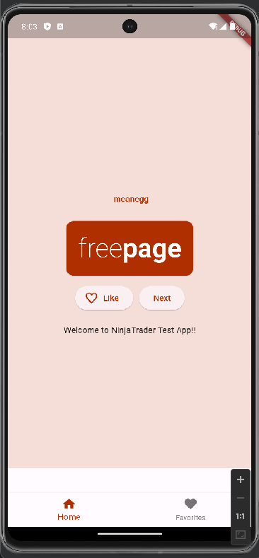

# flutter_test_app

Please follow the instructions in this readme guide for your assignment.

## Getting Started

#### Step 1: Project Setup

**A.** Feel free to use IDE of your choice.
You are only required to complete this assignment with tests working with either Android or iOS platforms.
**In-Scope:** mobile apps testing
**Out-of-scope:** Web or Desktop application

Notify your interviewer with the platform of your choice (iOS-simulator or Android-emulator) via below branching strategy.

**B.** Create a sidebranch from main branch following convention:
`<first_name>-<last_name>-<platform>`

Platform values can be: `android`, `ios` or `both`

`Example: First name is Luke, last name is Skywalker. Platform of choice: both. Branch name: luke-skywalker-both`

#### Step 2: Application walkthrough

Build and launch the flutter application from your choice of IDE.
On the home page of app you will see two options in bottom navigation bar: Home and Favorites.
On First lauch, home screen is default with Home icon enable and and Favorites icon is grayed out. Selecting Favorties icon takes to Favorites screen.

User can click on Next button to get the new pair of words.

**Sample home page image:**

#### Step 3: Write integration tests

Please wrtie integration tests in integration_test/integration_test.dart file.
The file has test scenarios listed.

Bonus:
Write a few widget tests under test/widget_test.dart file

Flutter development and testing resource: [online documentation](https://docs.flutter.dev/)
